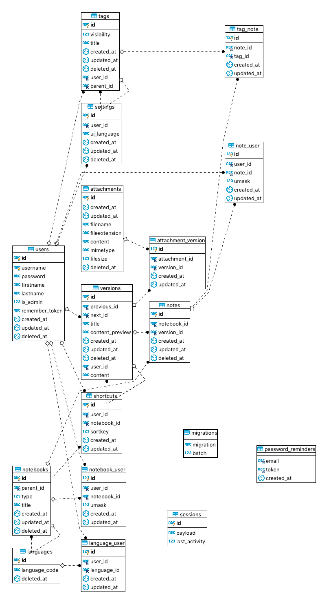

#LavNote开发流程
##建表SQL语句
  数据库的建表详情可以具体查看database.sql.
##ER图

##开发具体流程
###注册用户功能流程
1.接受页面传递的参数,参数的具体类型有username、fristname、lastname、password、language.
2.检查邮箱(username)是否注册，如果注册告知用户已经注册;否则进行第三步
3.封装数据，将数据插入数据库，保存的数据包含Users、Setting、NoteBook、NoteBookUser、Notes、TagNote、Versions、Tags、NoteUser
4.注册成功返回登录后的页面
